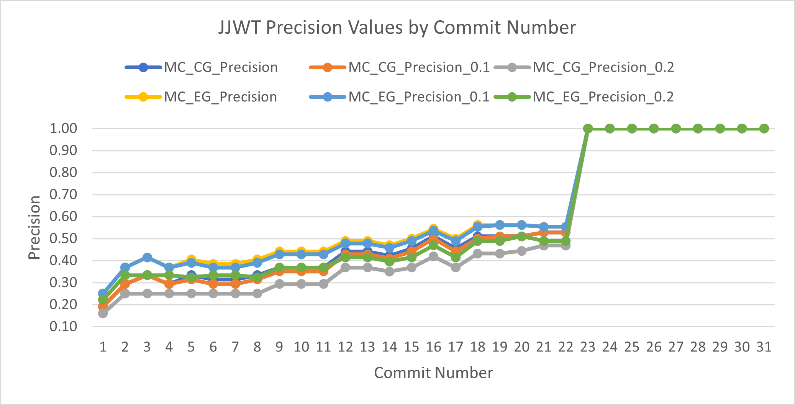
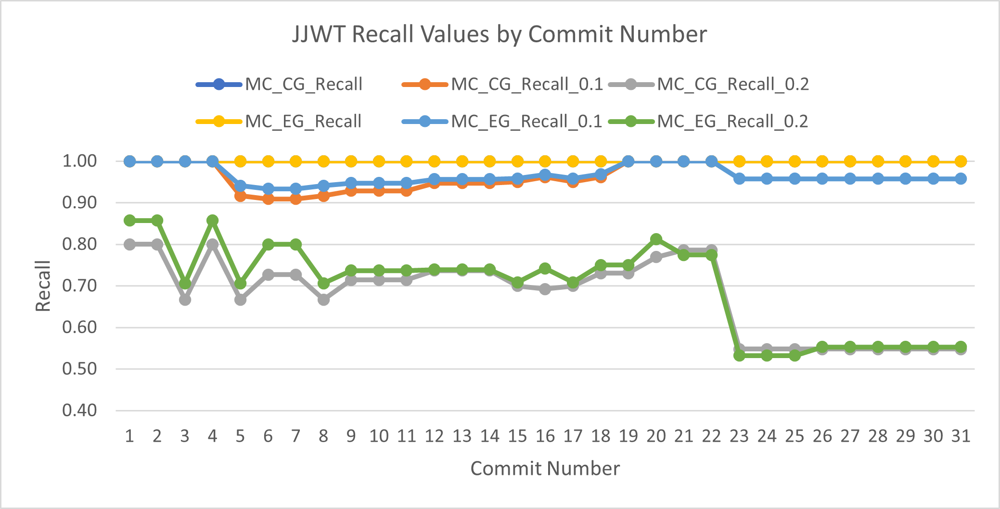
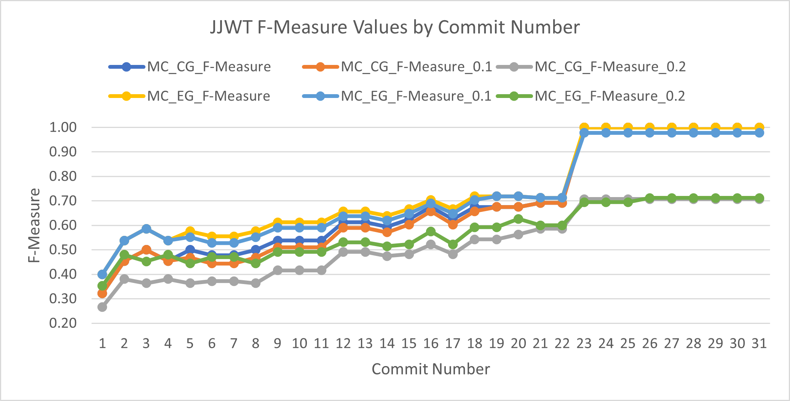

[Link to Commits](https://github.com/jwtk/jjwt/compare/0.6.0...0.7.0)

| Commit ID | SHA                                      | Type of Change            | MC_CG_Precision | MC_CG_Recall | MC_CG_F-Measure | MC_CG_Precision_0.1 | MC_CG_Recall_0.1 | MC_CG_F-Measure_0.1 | MC_CG_Precision_0.2 | MC_CG_Recall_0.2 | MC_CG_F-Measure_0.2 | MC_EG_Precision | MC_EG_Recall | MC_EG_F-Measure | MC_EG_Precision_0.1 | MC_EG_Recall_0.1 | MC_EG_F-Measure_0.1 | MC_EG_Precision_0.2 | MC_EG_Recall_0.2 | MC_EG_F-Measure_0.2 |
|-----------|------------------------------------------|---------------------------|-----------------|--------------|-----------------|---------------------|------------------|---------------------|---------------------|------------------|---------------------|-----------------|--------------|-----------------|---------------------|------------------|---------------------|---------------------|------------------|---------------------|
| 1         | 4020dfc1d51395f295b63bc60346839ccd4ff942 | CM                        | 0.1923          | 1.0000       | 0.3226          | 0.1923              | 1.0000           | 0.3226              | 0.1600              | 0.8000           | 0.2667              | 0.2500          | 1.0000       | 0.4000          | 0.2500              | 1.0000           | 0.4000              | 0.2222              | 0.8571           | 0.3529              |
| 2         | d1058b0933fa45e91e3f7d69efaf522e290a6d96 | CM, CNM, AM               | 0.2941          | 1.0000       | 0.4545          | 0.2941              | 1.0000           | 0.4545              | 0.2500              | 0.8000           | 0.3810              | 0.3684          | 1.0000       | 0.5385          | 0.3684              | 1.0000           | 0.5385              | 0.3333              | 0.8571           | 0.4800              |
| 3         | 83054a755d6533d2ac143ad066a9309a7d781bf7 | CM, AM                    | 0.3333          | 1.0000       | 0.5000          | 0.3333              | 1.0000           | 0.5000              | 0.2500              | 0.6667           | 0.3636              | 0.4146          | 1.0000       | 0.5862          | 0.4146              | 1.0000           | 0.5862              | 0.3333              | 0.7059           | 0.4528              |
| 4         | 1d525e94c687734f78fc4e835bd753995b606927 | AC, AM, CM                | 0.2941          | 1.0000       | 0.4545          | 0.2941              | 1.0000           | 0.4545              | 0.2500              | 0.8000           | 0.3810              | 0.3684          | 1.0000       | 0.5385          | 0.3684              | 1.0000           | 0.5385              | 0.3333              | 0.8571           | 0.4800              |
| 5         | a20c92c0954c2e294eca61cc9be77bdcdde3477d | AC, AM, CM                | 0.3333          | 1.0000       | 0.5000          | 0.3143              | 0.9167           | 0.4681              | 0.2500              | 0.6667           | 0.3636              | 0.4048          | 1.0000       | 0.5763          | 0.3902              | 0.9412           | 0.5517              | 0.3243              | 0.7059           | 0.4444              |
| 6         | 5385e0d7d3671b4736c0246475a03c648b1da68a | CM                        | 0.3143          | 1.0000       | 0.4783          | 0.2941              | 0.9091           | 0.4444              | 0.2500              | 0.7273           | 0.3721              | 0.3846          | 1.0000       | 0.5556          | 0.3684              | 0.9333           | 0.5283              | 0.3333              | 0.8000           | 0.4706              |
| 7         | 707f7bc046b363ac6262f43bdc0885ff04f35f1c | CM                        | 0.3143          | 1.0000       | 0.4783          | 0.2941              | 0.9091           | 0.4444              | 0.2500              | 0.7273           | 0.3721              | 0.3846          | 1.0000       | 0.5556          | 0.3684              | 0.9333           | 0.5283              | 0.3333              | 0.8000           | 0.4706              |
| 8         | 13d2e8370abacd87989f667767b2d239ccd6a5f7 | AC, AM, CM, AFF           | 0.3333          | 1.0000       | 0.5000          | 0.3143              | 0.9167           | 0.4681              | 0.2500              | 0.6667           | 0.3636              | 0.4048          | 1.0000       | 0.5763          | 0.3902              | 0.9412           | 0.5517              | 0.3243              | 0.7059           | 0.4444              |
| 9         | 72e0e3b23c4f363fd367220945e5549c8f3564d3 | AF, DC, AC, AM, CM        | 0.3684          | 1.0000       | 0.5385          | 0.3514              | 0.9286           | 0.5098              | 0.2941              | 0.7143           | 0.4167              | 0.4419          | 1.0000       | 0.6129          | 0.4286              | 0.9474           | 0.5902              | 0.3684              | 0.7368           | 0.4912              |
| 10        | 9e1ee67582fb23d172b0e338a51a0211d2e63715 | AC, AM, CM, AFF           | 0.3684          | 1.0000       | 0.5385          | 0.3514              | 0.9286           | 0.5098              | 0.2941              | 0.7143           | 0.4167              | 0.4419          | 1.0000       | 0.6129          | 0.4286              | 0.9474           | 0.5902              | 0.3684              | 0.7368           | 0.4912              |
| 11        | 3dfae9a31d6492f996c6aaefc77d5354549348bc | DF, AF                    | 0.3684          | 1.0000       | 0.5385          | 0.3514              | 0.9286           | 0.5098              | 0.2941              | 0.7143           | 0.4167              | 0.4419          | 1.0000       | 0.6129          | 0.4286              | 0.9474           | 0.5902              | 0.3684              | 0.7368           | 0.4912              |
| 12        | e392524919ecd155c00240533f54e66b6b1eaa82 | AC, AF, CM, AM, DAbC, AFC | 0.4419          | 1.0000       | 0.6129          | 0.4286              | 0.9474           | 0.5902              | 0.3684              | 0.7368           | 0.4912              | 0.4894          | 1.0000       | 0.6571          | 0.4783              | 0.9565           | 0.6377              | 0.4146              | 0.7391           | 0.5313              |
| 13        | 29f980c5c974eba271b77ace3df72948eaf40809 | DF, AM                    | 0.4419          | 1.0000       | 0.6129          | 0.4286              | 0.9474           | 0.5902              | 0.3684              | 0.7368           | 0.4912              | 0.4894          | 1.0000       | 0.6571          | 0.4783              | 0.9565           | 0.6377              | 0.4146              | 0.7391           | 0.5313              |
| 14        | 39ee58a5115ba8364f2617a927adc16dbfa86e3a | AM, AC                    | 0.4222          | 1.0000       | 0.5938          | 0.4091              | 0.9474           | 0.5714              | 0.3500              | 0.7368           | 0.4746              | 0.4694          | 1.0000       | 0.6389          | 0.4583              | 0.9565           | 0.6197              | 0.3953              | 0.7391           | 0.5152              |
| 15        | 4be4912cb24e0effe6f2f49b25f4e439b4f24b6d | AM, DC                    | 0.4545          | 1.0000       | 0.6250          | 0.4419              | 0.9500           | 0.6032              | 0.3684              | 0.7000           | 0.4828              | 0.5000          | 1.0000       | 0.6667          | 0.4894              | 0.9583           | 0.6479              | 0.4146              | 0.7083           | 0.5231              |
| 16        | a73e0044b8b2a2214714e183f3a1ed35e7430b73 | AC, AM, CM, AF            | 0.5098          | 1.0000       | 0.6753          | 0.5000              | 0.9615           | 0.6579              | 0.4186              | 0.6923           | 0.5217              | 0.5439          | 1.0000       | 0.7045          | 0.5357              | 0.9677           | 0.6897              | 0.4694              | 0.7419           | 0.5750              |
| 17        | 61510dfca58dd40b4b32c708935126785dcff48c | AM, CM, DC                | 0.4545          | 1.0000       | 0.6250          | 0.4419              | 0.9500           | 0.6032              | 0.3684              | 0.7000           | 0.4828              | 0.5000          | 1.0000       | 0.6667          | 0.4894              | 0.9583           | 0.6479              | 0.4146              | 0.7083           | 0.5231              |
| 18        | ceac032f11ebc0bf829c68961ca3c643eb85f70e | AM, CM                    | 0.5098          | 1.0000       | 0.6753          | 0.5000              | 0.9615           | 0.6579              | 0.4318              | 0.7308           | 0.5429              | 0.5614          | 1.0000       | 0.7191          | 0.5536              | 0.9688           | 0.7045              | 0.4898              | 0.7500           | 0.5926              |
| 19        | e55ea34e951f8bbc8be50a49b166949a4d1e4873 | CM                        | 0.5098          | 1.0000       | 0.6753          | 0.5098              | 1.0000           | 0.6753              | 0.4318              | 0.7308           | 0.5429              | 0.5614          | 1.0000       | 0.7191          | 0.5614              | 1.0000           | 0.7191              | 0.4898              | 0.7500           | 0.5926              |
| 20        | 3fb794ee9131b9e6d6f0c24e408b05e53025aa79 | AF, AM, CM                | 0.5098          | 1.0000       | 0.6753          | 0.5098              | 1.0000           | 0.6753              | 0.4444              | 0.7692           | 0.5634              | 0.5614          | 1.0000       | 0.7191          | 0.5614              | 1.0000           | 0.7191              | 0.5098              | 0.8125           | 0.6265              |
| 21        | 9735d1ad98678b15b04f65bd8f88daa32f6f5618 | AM, CM                    | 0.5283          | 1.0000       | 0.6914          | 0.5283              | 1.0000           | 0.6914              | 0.4681              | 0.7857           | 0.5867              | 0.5536          | 1.0000       | 0.7126          | 0.5536              | 1.0000           | 0.7126              | 0.4898              | 0.7742           | 0.6000              |
| 22        | f522abe2cb672185a5cf24c5170e54e6ca51650e | AM, CM                    | 0.5283          | 1.0000       | 0.6914          | 0.5283              | 1.0000           | 0.6914              | 0.4681              | 0.7857           | 0.5867              | 0.5536          | 1.0000       | 0.7126          | 0.5536              | 1.0000           | 0.7126              | 0.4898              | 0.7742           | 0.6000              |
| 23        | 0f63ec80120ef8ee7844a3d764acf43a2598bf19 | AM                        | 1.0000          | 1.0000       | 1.0000          | 1.0000              | 1.0000           | 1.0000              | 1.0000              | 0.5476           | 0.7077              | 1.0000          | 1.0000       | 1.0000          | 1.0000              | 0.9574           | 0.9783              | 1.0000              | 0.5319           | 0.6944              |
| 24        | 19740695616b827f484a96344757fb07eee0db5c | CM                        | 1.0000          | 1.0000       | 1.0000          | 1.0000              | 1.0000           | 1.0000              | 1.0000              | 0.5476           | 0.7077              | 1.0000          | 1.0000       | 1.0000          | 1.0000              | 0.9574           | 0.9783              | 1.0000              | 0.5319           | 0.6944              |
| 25        | 5b15b9363e05418ea012ff9d38eba4d3a86f9fc5 | CM                        | 1.0000          | 1.0000       | 1.0000          | 1.0000              | 1.0000           | 1.0000              | 1.0000              | 0.5476           | 0.7077              | 1.0000          | 1.0000       | 1.0000          | 1.0000              | 0.9574           | 0.9783              | 1.0000              | 0.5319           | 0.6944              |
| 26        | ff932e9838a9961f4084a51323092559e1a1ad25 | AM, AF, CM                | 1.0000          | 1.0000       | 1.0000          | 1.0000              | 1.0000           | 1.0000              | 1.0000              | 0.5476           | 0.7077              | 1.0000          | 1.0000       | 1.0000          | 1.0000              | 0.9574           | 0.9783              | 1.0000              | 0.5532           | 0.7123              |
| 27        | a06e35cf84aa8880011c2ffae5778a296835ab89 | AF, AM, CM                | 1.0000          | 1.0000       | 1.0000          | 1.0000              | 1.0000           | 1.0000              | 1.0000              | 0.5476           | 0.7077              | 1.0000          | 1.0000       | 1.0000          | 1.0000              | 0.9574           | 0.9783              | 1.0000              | 0.5532           | 0.7123              |
| 28        | 8f1b528d8c6593b4a39c0b5e7cc686c8a7ac92e8 | CPM, CNM, CNF, CTF, CM    | 1.0000          | 1.0000       | 1.0000          | 1.0000              | 1.0000           | 1.0000              | 1.0000              | 0.5476           | 0.7077              | 1.0000          | 1.0000       | 1.0000          | 1.0000              | 0.9574           | 0.9783              | 1.0000              | 0.5532           | 0.7123              |
| 29        | ab4f9ff9e85c0bda785026e1ad04fc448a710e65 | CNF, CM                   | 1.0000          | 1.0000       | 1.0000          | 1.0000              | 1.0000           | 1.0000              | 1.0000              | 0.5476           | 0.7077              | 1.0000          | 1.0000       | 1.0000          | 1.0000              | 0.9574           | 0.9783              | 1.0000              | 0.5532           | 0.7123              |
| 30        | 6c4b58e4fe1bdae811560cb6b5234d65e2c553f3 | CM                        | 1.0000          | 1.0000       | 1.0000          | 1.0000              | 1.0000           | 1.0000              | 1.0000              | 0.5476           | 0.7077              | 1.0000          | 1.0000       | 1.0000          | 1.0000              | 0.9574           | 0.9783              | 1.0000              | 0.5532           | 0.7123              |
| 31        | b13650dc60d725f666c1b27b40fb1d779fdee643 | AF, AM, CM                | 1.0000          | 1.0000       | 1.0000          | 1.0000              | 1.0000           | 1.0000              | 1.0000              | 0.5476           | 0.7077              | 1.0000          | 1.0000       | 1.0000          | 1.0000              | 0.9574           | 0.9783              | 1.0000              | 0.5532           | 0.7123              |
